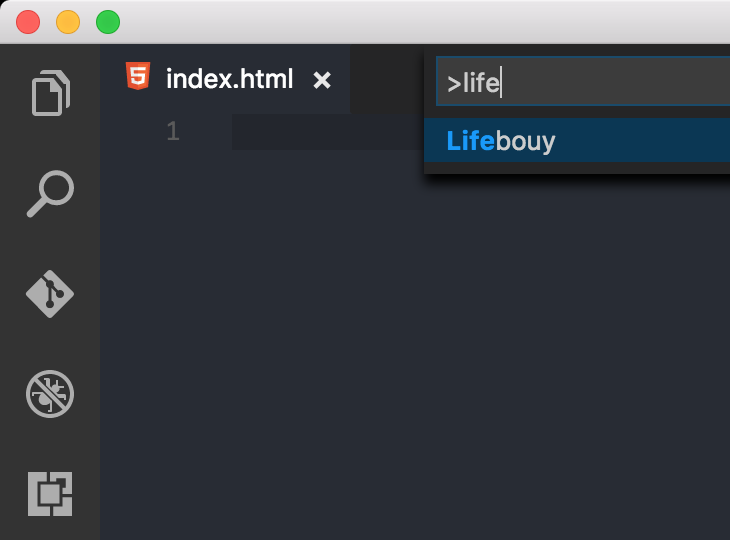

# lifebuoy README

This is the README for "lifebuoy" extension.

This extension informs every VS code user of the battery level of their machine regarless of Operating System.

## Features

Once the extension is updated the battery-level is displayed on the right-hand side of the status bar of VS Code. Here is a screenshot:

## 2 Easy Steps

1. Run Lifebouy

    Press Ctrl+Shift+P (Mac: Cmd+Shift+P) then type `Lifebouy` Lifebouy should appear in the dropdown list.

    

2. Close the information bar upon activation

    

## Requirements

The extension requires the npm package: [battery-level](https://www.npmjs.com/package/battery-level)

To install it, simply run:

`$ npm install battery-level`

<!--
Next release
## Extension Settings

Include if your extension adds any VS Code settings through the `contributes.configuration` extension point.

For example:

This extension contributes the following settings:

* `myExtension.enable`: enable/disable this extension
* `myExtension.thing`: set to `blah` to do something
-->

## Known Issues

- The battery level is not updating in real time.
- The float point of the battery level is sometimes skewed. The issue is open [here](https://github.com/NdagiStanley/lifesaver/issues/1).

## Release Notes

Users appreciate release notes as you update your extension.

### 1.0.0

Initial release of lifebuoy :fireworks: :fire:

<!--
### 1.0.1

Fixed issue #.

### 1.1.0

Added features X, Y, and Z.
-->

**Enjoy!**