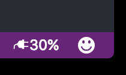
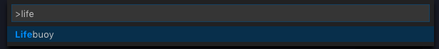

# lifebuoy README

This is the README for "lifebuoy" extension.

This extension informs every VS code user of the battery level of their machine regarless of Operating System.

## Features

Once the extension is updated the battery-level is displayed on the right-hand side of the status bar of VS Code. Here are 2 screenshots:

While on battery:

While on charge:

## 2 Easy Steps

1. Run Lifebuoy

    Press Ctrl+Shift+P (Mac: Cmd+Shift+P) then type `Lifebuoy` Lifebuoy should appear in the dropdown list.

    

2. Close the information bar upon activation

    

<!--## Requirements
-->

<!--
Next release
## Extension Settings

Include if your extension adds any VS Code settings through the `contributes.configuration` extension point.

For example:

This extension contributes the following settings:

* `myExtension.enable`: enable/disable this extension
* `myExtension.thing`: set to `blah` to do something
-->

## Known Issues

The issues are listed [here](https://github.com/NdagiStanley/lifebuoy/issues)

## Release Notes

Users appreciate release notes as you update your extension.

### 1.0.0

Initial release of lifebuoy :fireworks: :fire:

### 1.1.1

Fixed issue [#7](https://github.com/NdagiStanley/lifebuoy/issues/7).

<!--
### 1.1.0

Added features X, Y, and Z.
-->

**Enjoy!**